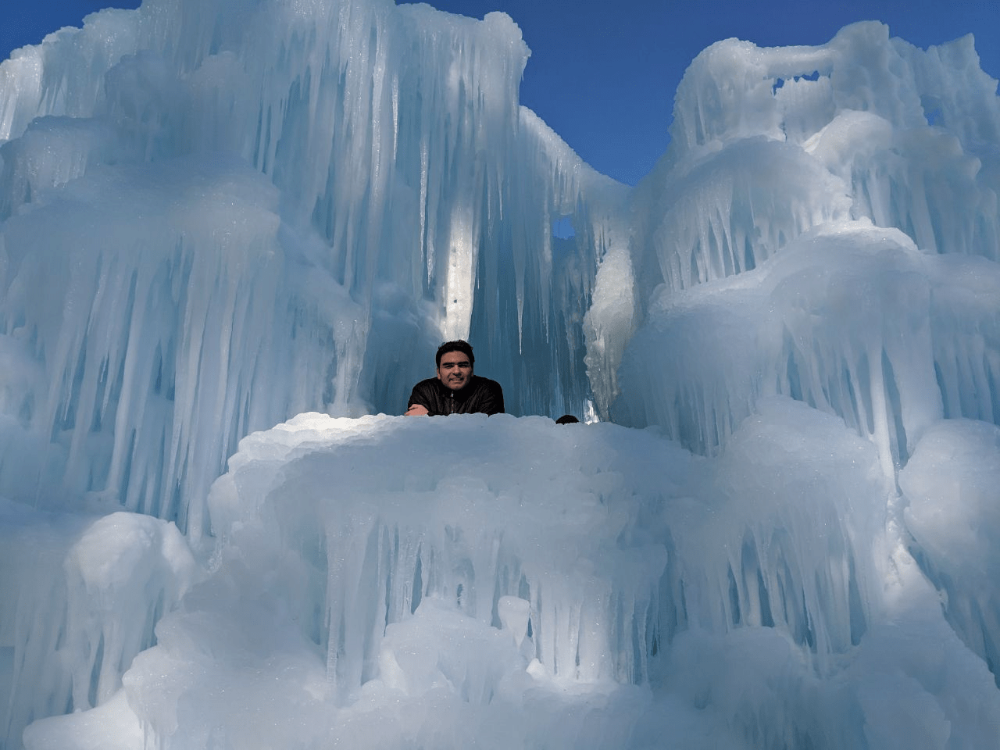
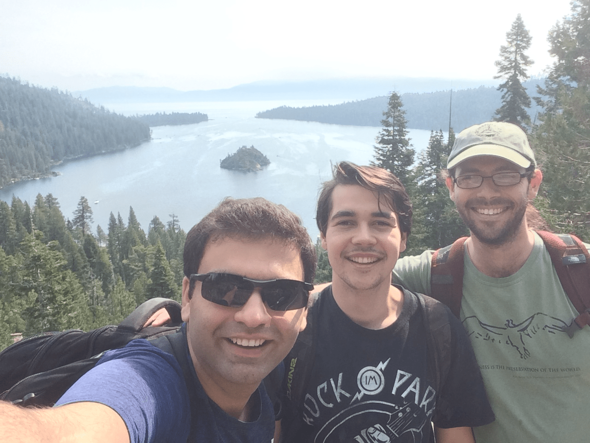

I was born in [Shiraz](https://en.wikipedia.org/wiki/Shiraz), Iran and only after couple of **months**, I looked like these:

  
  

 
I guess now you realized why I wrote months in bold!
 
 
 
My hometown is a warm and dry city so I am not sure what I was thinking when I moved to the U.S. in 2015 to first go to Notre Dame, IN and now New England!

  

*Ice castle in Woodstock, New Hampshire*

 
 
However, living in New England made me connect to the nature and now wherever I go I just look for woods, lakes, and mountains!

  

*Hanover, New Hampshire*

  

*Lake Tahoe, Nevada*

