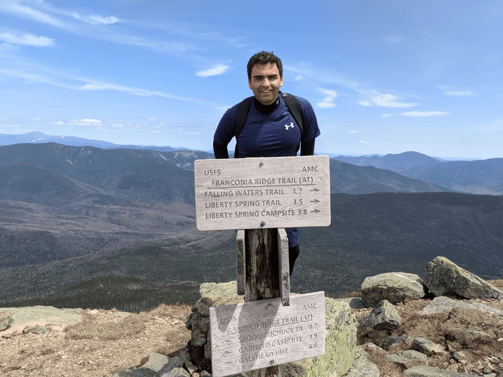
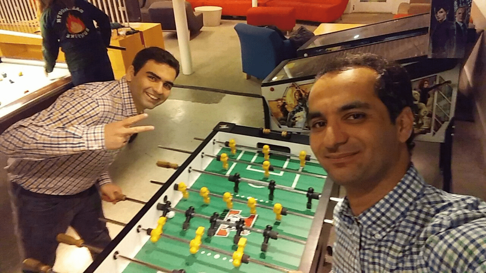
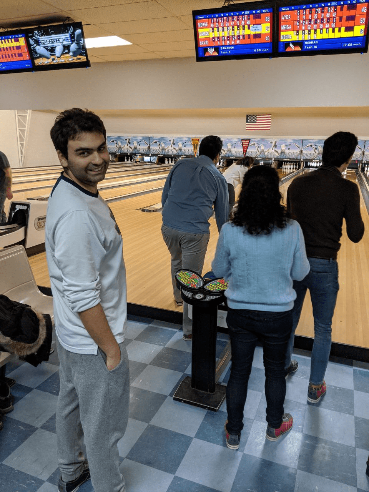

I was born in [Shiraz](https://en.wikipedia.org/wiki/Shiraz), Iran and only after couple of **months**, I looked like these:

  
  

 
I guess now you realized why I wrote months in bold!
 
 
 
My hometown is a warm and dry city so I am not sure what I was thinking when I moved to the U.S. in 2015 to first go to Notre Dame, IN and now New England!

  

Ice castle in Woodstock, New Hampshire

 
 
However, living in New England made me to connect to the nature and now wherever I go I just look for woods, lakes, trails, and mountains!

  

Hanover, New Hampshire

  

Lake Tahoe, Nevada

 
 
Furthermore, by living in New England, I have found my favorite hobby and it is hiking!

  

Mt Cube, Orford, New Hampshire

  

Franconia Range, Franconia, New Hampshire

 
 
Unfortunately since 6 months of the year is winter here and I am not that much a winter hiker, I have other hobbies that I do when it is cold outside such as playing foosball (I am good at it), bowling (I thought I am good at it until I played against a pro), drawing (I am not sure about this), and cooking(I am good at it! I believe that)!

  

Collis Center, Dartmouth College

  

Maple Lanes bowling alley, Claremont, New Hampshire

  

Charcoal drawing while staying at home to save lives

  

A Persian food called Tahchin

 
 
Finally, I should mention I do all these activities while I am listening to may favorite singer **Celine Dion** which I can't be happier that I went to her concert in Boston and my dream came true seeing her singing My Heart Will Go On live!

  

CEline Dion's concert in Boston
