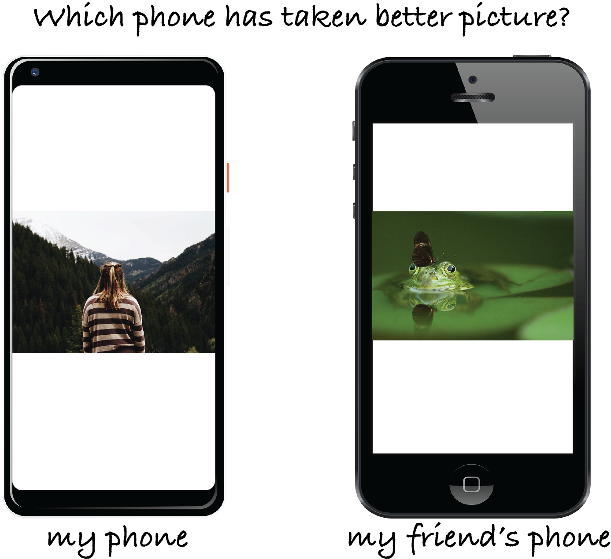
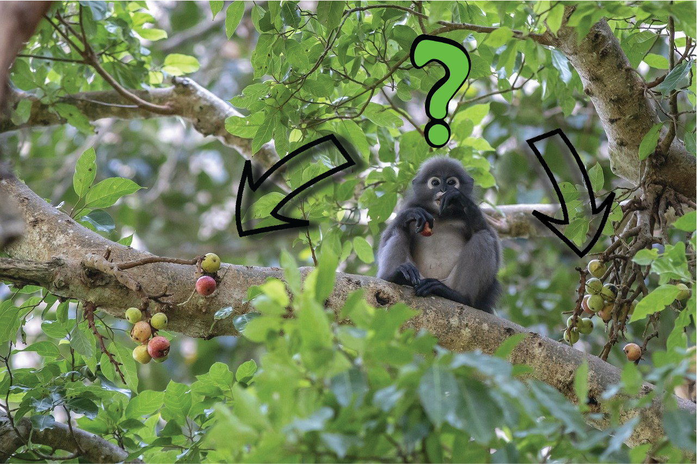
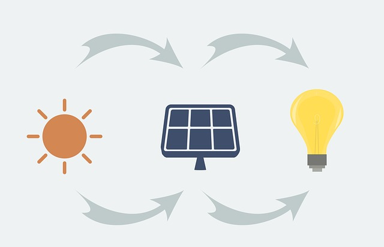

My research studies so far can be summarized into two broad areas:
  * Role of reward feedback in cognition and metacognition (real intelligence)
  * Intelligent control system design (artificial intelligence)

**Note**: In order to make science more accessible and also remind myself why I am doing what I am doing, I like to write a summary of my projects in plain language without adding the scientific terminologies and complexities. So, I first write a ***1-minute summary*** in plain language and then ***Long summary*** for who might like to see more complicated stuff!
 

**Role of reward feedback in cognition and metacognition (real intelligence)**

During my Ph.D. studies at Dartmouth College, I have been involved in different projects which all have one thing in common: **feedback**! We are interested in understanding how reward feedback interacts with different metacognitive processes such as confidence, and also cognitive processes such as learning, perception or attention.

* **Interaction of reward and confidence in an uncertain environment.** In one of our studies with collaboration with brilliant scientists from UCLA which was published and featured in Editor's highlights in [Nature Communications](https://www.nature.com/articles/s41467-019-12725-1), we studied how reward feedback and confidence in choice interact in an environment with uncertainty in both reward and visual information.

  

>>>
**1-minute summary:** Assume that you took a multiple-choice test. For a few questions, you are sure that you know the correct answer and therefore you respond with confidence. When you get the grades back, you realize you were correct in most of those questions. However, you were also wrong is a few of those questions. On the other hand, there are some questions that you had doubt while responding. Some of them turned out to be correct and some wrong. First, how our brains calculate the confidence, so we feel confident in some questions and not in the others? Second, how differently we learn from our mistakes in those questions that we were confident but wrong compared to those questions that we were not that confident and wrong? We studied two different brain regions (ACC and BLA) in rats to find the answer to these questions.
>>>
>>>
**Long summary:** We knew that subjective sense of certainty, or confidence, in ambiguous sensory cues can alter the interpretation of reward feedback and facilitate learning. However, the interactions between these processes are less known. We trained rats to report the orientation of ambiguous visual stimuli according to a spatial stimulus-response rule that must be learned. Following choice, rats could wait a self-timed delay for reward or initiate a new trial. We found that waiting times increase with discrimination accuracy, demonstrating that this measure can be used as a proxy for confidence. We then used chemogenetic silencing of BLA and ACC to study their roles in calculation of confidence and their roles in learning from reward feedback. We observed that inhibition of BLA shortens waiting times overall whereas ACC inhibition renders waiting times insensitive to confidence, suggesting contribution of ACC but not BLA to confidence computations. We then used a reversal learning task to see how learning is affected by confidence. Both ACC and BLA inhibition blocked the enhancement of learning due to confidence but via differential adjustments in learning strategies and consistent use of learned rules. Altogether, we demonstrated dissociable roles for ACC and BLA in transmitting confidence and learning under uncertainty.
>>>

* **Interaction of reward and perception in an uncertain environment.** In a study with help of amazing undergraduate research assistants which was published in [Journal of Cognitive Neuroscience](https://www.mitpressjournals.org/doi/full/10.1162/jocn_a_01516), we studied how reward feedback affects perceptual decision making. 

  

>>>
**1-minute summary:** Imagine deciding whether your Google Pixel or your friend’s iPhone takes sharper photos. To make this decision impartially, you look at some photos on both phones but end up favoring your own phone. Your decision could be impartial and entirely based on perceived quality of photos on the two phones but could also be influenced by fun memories of taking photos with your phone. We wanted to see which hypothesis is more probable.
>>>
>>>
**Long summary:** Perceptual decision-making has been shown to be influenced by reward expected from alternative options or actions, but the underlying neural mechanisms are currently unknown. More specifically, it is debated whether reward effects are mediated through changes in sensory processing, later stages of decision-making, or both. To address this question, we conducted two experiments in which human participants made saccades to what they perceived to be either the first or second of two visually identical but asynchronously presented targets while we manipulated expected reward from correct and incorrect responses on each trial. By comparing reward-induced bias in target selection (i.e., reward bias) during the two experiments, we determined whether reward caused changes in sensory or decision-making processes. We found similar reward biases in the two experiments indicating that reward information mainly influenced later stages of decision-making. Moreover, the observed reward biases were independent of the individual's sensitivity to sensory signals. This suggests that reward effects were determined heuristically via modulation of decision-making processes instead of sensory processing. To further explain our findings and uncover plausible neural mechanisms, we simulated our experiments with a cortical network model and tested alternative mechanisms for how reward could exert its influence. We found that our experimental observations are more compatible with reward-dependent input to the output layer of the decision circuit. Together, our results suggest that, during a temporal judgment task, reward exerts its influence via changing later stages of decision-making (i.e., response bias) rather than early sensory processing (i.e., perceptual bias).
>>>

* **Dissociation of reward effect on choice and visual information processing.** In a study in collaboration with Prof. [Tirin Moore](https://profiles.stanford.edu/tirin-moore)'s lab in Stanford University, we studied how reward feedback affects decision making and processing of visual information simultaneously. The manuscript is under review, but the preprint is available on [bioRxiv](https://www.biorxiv.org/content/10.1101/2020.04.07.029942v1.abstract).

  

>>>
**1-minute summary:** Imagine you want to buy a car. You are in a store which has both makes of Tesla and Lexus. Assume that in the first scenario, you like one of the brands way more than the other. Then, it might make the decision easier, right? In the second scenario, assume that you like both of them kind of equally. So, the decision of which one to buy becomes harder. However, does it differ how much we pay attention to the car we want to buy and its interior and exterior (and generally the details) while we are test driving it in either of the scenarios? In a study with monkeys, we tried to find an answer to these types of questions.
>>>
>>>
**Long summary:** Primate vision is characterized by constant, sequential processing and selection of visual targets to fixate. Although expected reward is known to influence both processing and selection of visual targets, the similarities and the differences between these effects remains unclear. Using a novel paradigm, we simultaneously measured the effects of expected reward on target selection and sensitivity to visual motion in monkeys. Monkeys freely chose between two visual targets and received a juice reward with varying probability for eye movements made to either of them. Targets were stationary apertures of drifting gratings, causing the endpoints of eye movements to these targets to be systematically biased in the direction of motion. We used this motion-induced bias as a measure of sensitivity to visual motion on each trial. Then, we utilized multiple measures to explore global and local effects of reward outcomes on choice and sensitivity to visual motion to find dissociations of reward effect on these two processes. Specifically, we used different reinforcement learning models to fit choice behavior and calculate different estimated values based on the integration of reward outcomes over multiple trials. Moreover, to compare the effects of estimated value on choice and sensitivity to motion directly, we considered correlations between each of these variables and integrated reward outcomes on a wide range of timescales. We found that in addition to choice, sensitivity to visual motion was also influenced by estimated value, even though the motion was irrelevant in receiving a reward. However, choice was determined by the difference in estimated values of the two options whereas sensitivity to motion was influenced by the sum of the estimated values. Moreover, models that best predicted visual processing and choice used sets of estimated values based on different types of reward integration and timescales. Together, our results demonstrate separable influences of reward on visual processing and choice, and point to the presence of multiple brain circuits for integration of reward outcomes.
>>>

* **Contribution of FEF to adaptive target selection.** This is an ongoing project in collaboration with Prof. [Tirin Moore](https://profiles.stanford.edu/tirin-moore)'s lab in Stanford University in which using computational modeling and electrophysiological manipulation, we aim to study the role of Frontal Eye Field in adaptive value-based decision making. The preprint would be out soon, so be sure to tune in for the updates!

* **Adaptive learning in volatile environments.** This is another ongoing project that I have been working on in the past 2 years in collaboration with outstanding scientists from UCLA and University of Minnesota. We are using computational modeling and Psychophysics to study how we approximate the volatility of the environment and make a decision correspondingly based on the reward feedback. We are still working on it, so be sure to tune in for the updates!

**Intelligent control system design (artificial intelligence)**

During my studies in the first years of college, when I was studying all these hard mathematics and control theory courses in Electrical Engineering, I was always amazed and curious how our brain does all of those stuff so quickly. We do lots of math operations in our mind without even trying. We control our body, movements, and make decisions in a way that seems so effortless. That was actually one of the main reasons I pursued Neuroscience in my Ph.D. to better understand the brain. So, I studied [intelligent control systems](http://www2.ece.ohio-state.edu/~passino/ic-chapter.pdf) which are inspired by human knowledge and logic during my undergrad and master's studies.

* **Fuzzy controller design to improve the efficiency of renewable energies.** In this project which was in collaboration with Prof. [Frede Blaabjerg](https://en.wikipedia.org/wiki/Frede_Blaabjerg) in Aalborg University in Denmark and amazing researchers from Shiraz University of Technology in Iran, we studied how we can use different types of fuzzy controllers to improve the efficiency of renewable energy production, specifically for solar energy. The results of the project were published in different journals, such as [IEEE Journal of Emerging and Selected Topics in Power Electronics](https://ieeexplore.ieee.org/abstract/document/7934313), and [Journal of Dynamic Systems, Measurement, and Control](https://asmedigitalcollection.asme.org/dynamicsystems/article/139/5/051010/384527/Dynamic-Model-Based-Fuzzy-Controller-for-Maximum).

  

>>>
**1-minute summary:** Imagine you have a house with solar cells on the roof of the house to generate your own electricity. During the day, based on the weather, cloud coverage, and temperature, the amount of sun light that hits the solar cell changes. Furthermore, the number of home appliances that needs electricity to function also changes during the day. We have studied how can we manipulate some properties of solar cell during the day based on the weather and electrical appliances being used in the house to ensure that we are generating the maximum solar energy from the solar cells all day. We have used an approach called fuzzy control which tries to emulate the experience and knowledge of a human operator to ensure the maximum solar power generation.
>>>
>>>
**Long summary:** We introduced two different control approaches to increase the performance and efficiency of the solar photovoltaic (PV) electricity generation; fuzzy descriptor representation with model-based dynamic nonparallel-distributed compensation (non-PDC) controller, and polynomial fuzzy model (PFM)-based controller.
The proposed approach using fuzzy descriptor representation with model-based dynamic nonparallel-distributed compensation (non-PDC) controller exploited a non-quadratic Lyapunov function (NQLF) to convert the controller design problem into a linear matrix inequality (LMI) problem. Furthermore, some slack LMI variables were introduced in the problem formulation which led to more relaxed conditions.
The proposed approach using polynomial fuzzy model is a generalization of the standard Takagi–Sugeno fuzzy models and linear matrix inequality. We developed a direct maximum power (DMP)-based control structure which was formulated in terms of Sum of Squares (SOS) conditions. Unlike the conventional approaches, the proposed approach did not require exploring the maximum power operational point. Finally, in order to show the effectiveness of the method, we used hardware-in-the-loop simulations and observed its effectiveness in tracking the maximum power point in a very short time.
>>>

* **Distributed fuzzy controller design for systems with partial differential equation modeling.** In this study which was in collaboration with outstanding researchers from Universidad de Valladolid in Spain, we proposed a systemic approach for designing fuzzy controller for systems that their dynamics can be modeled as partial differential equations. The results of the study are published in [IEEE Transactions on Fuzzy Systems](https://ieeexplore.ieee.org/abstract/document/7888450/authors#authors), and [IFAC-PapersOnLine](https://www.sciencedirect.com/science/article/pii/S2405896316323795).

  

>>>
**1-minute summary:** Until we are hopefully transitioned completely to renewable energies, we need to make sure the production from fossil fuels and other chemical and biological processes are as efficient as possible to minimize pollution and waste of the products to nature. Therefore, it is important to make sure the conditions in which the process generates the high quality product is satisfied and maintained. The behavior of many of these types of processes can be modeled in a way that the products quality depends on both time of the process as well as on different parts of the process (for example, a fuel reactor). We call these models partial differential equation in mathematics. In general, controlling these types of models is a hard problem and yet we don't have solution for many of them. We proposed an approach that emulates a human operator's knowledge and experience to tackle this problem.
>>>
>>>
**Long summary:** In this study, we presented a systematic approach to deal with the saturated control of a class of distributed parameter systems that can be modeled by the first-order hyperbolic partial differential equations (PDE). The approach extends (also improves over) the existing fuzzy Takagi–Sugeno (TS) state feedback designs for such systems by applying the concepts of the polynomial sum-of-squares (SOS) techniques. First, a fuzzy-polynomial model via Taylor series was used to model the semi-linear hyperbolic PDE system. Second, the closed-loop exponential stability of the fuzzy-PDE system was studied through the Lyapunov theory. This allowed us to derive a design methodology in which a more complex fuzzy state-feedback control was designed in terms of a set of SOS constraints which were then numerically computed via semidefinite programming. Finally, we showed the effectiveness of the proposed approach with simulating the output of a non-isothermal plug-flow reactor.
>>>

