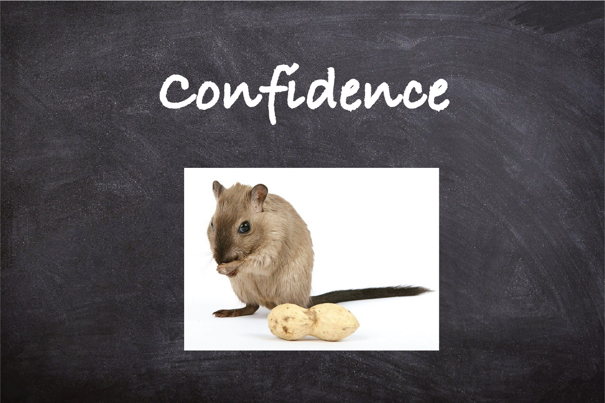

My research studies so far can be summarized in two broad areas:
  * Role of reward feedback in cognition and metacognition (real intelligence)
  * Intelligent control system design (artificial intelligence)

 

**Role of reward feedback in cognition and metacognition (real intelligence)**

During my Ph.D. studies at Dartmouth College, I have been involved in different projects which all have one thing in common: **feedback**! We are interested to understand how reward feedback interacts with different metacognitive processes such as confidence, and also cognitive processes such as learning, perception or attention.

* **Interaction of reward and confidence in an uncertain environment.** In one of our studies which was published and featured in Editor's highlights in [Nature Communications](https://www.nature.com/articles/s41467-019-12725-1) with collaboration with brilliant scientists from UCLA, we studied how reward feedback and confidence in choice interact in an environment with uncertainty in both reward and visual information.

  

<pre>We knew that subjective sense of certainty, or confidence, in ambiguous sensory cues can alter the interpretation of reward feedback and facilitate learning. However, the interactios between these processes are less known. We trained rats to report the orientation of ambiguous visual stimuli according to a spatial stimulus-response rule that must be learned. Following choice, rats could wait a self-timed delay for reward or initiate a new trial. We found that waiting times increase with discrimination accuracy, demonstrating that this measure can be used as a proxy for confidence. We then used chemogenetic silencing of BLA and ACC to study their roles in calculation of confidence and their roles in learning from reward feedback. We observed that inhibition of BLA shortens waiting times overall whereas ACC inhibition renders waiting times insensitive to confidence, suggesting contribution of ACC but not BLA to confidence computations. We then used a reversal learning task to see how learning is affected by confidence. Both ACC and BLA inhibition blocked the enhancement of learning due to confidence but via differential adjustments in learning strategies and consistent use of learned rules. Altogether, we demonstrated dissociable roles for ACC and BLA in transmitting confidence and learning under uncertainty.

**Intelligent control system design (artificial intelligence)**

in

